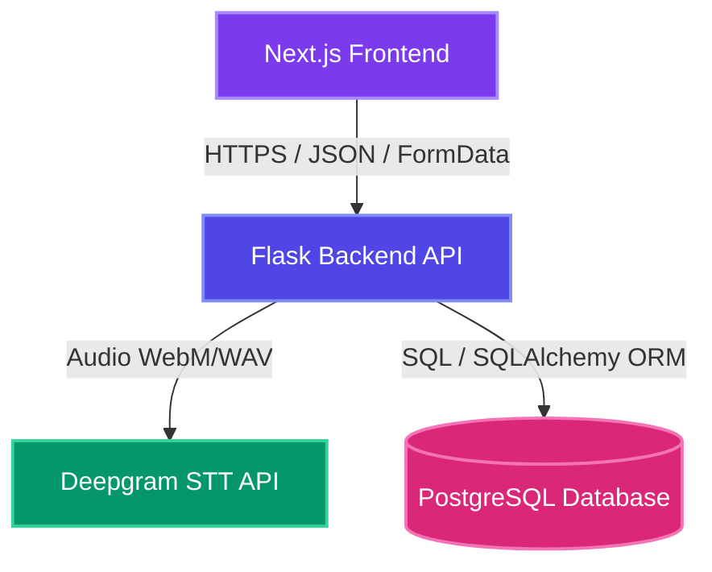

# 🎙️ VoiceScript AI — Full-Stack Speech to Text SaaS

VoiceScript AI is a production-ready, high-fidelity speech-to-text web application. Users can capture audio directly via their browser (or upload existing files), preview and download clips, fetch live punctuated transcriptions, view transcript archives, edit metadata, and manage private transcript collections with standard JWT authorization.

---

## 🚀 Features

### 🎤 High-Fidelity Audio Capturing
* Capture microphone audio via standard browser **MediaRecorder APIs** (WebM format).
* Beautiful live soundwave graphics and recording timers.
* Integrated local preview player with dedicated **Download Recording** and **Delete Recording** controllers.
* Native drag-and-drop file upload support for standard extensions (`webm`, `wav`, `mp3`, `m4a`, `ogg`, max 10MB).

### 🧠 Server-Side 16kHz Mono WAV Conversion
* Backend leverages `pydub` to automatically convert uploaded files into a uniform **16kHz mono WAV** format for optimal Deepgram STT transcription results.
* **Resilient Fail-Safe Block**: If `ffmpeg` or `pydub` is missing in a local development environment, the transcription pipeline gracefully falls back to sending the original file directly to Deepgram, ensuring zero downtime.

### 📝 AI Speech-to-Text Transcription
* Fully integrated with Deepgram STT REST endpoints.
* Enables smart punctuation, automatic formatting, and language detection.
* Interactive typewriter text reveal animations inside the transcript console.

### 🗂️ Persistent Transcript History
* Saved securely in PostgreSQL with relational schemas using SQLAlchemy ORM.
* Full-featured history search, copies, exports (plain `.txt`), renames, and deletions.
* Dynamic detail routing (`/history/[id]`) showing word counts, duration chips, and timestamps.

### 🔐 Multi-User Authentication
* JWT token-based authorization via `flask-jwt-extended`.
* Secure registration, login, and profile modification portal (with options to update username, email, and password).
* Secure endpoint protection redirecting unauthenticated users to `/login`.

### 🎨 Premium Dark-Themed UI
* Built with React + Next.js App Router and Tailwind CSS v4.
* Modern typography (Space Grotesk & Inter), glassmorphism styles, soundwave pulses, and smooth transitions.

---

## 🧩 Project Architecture



---

## 📂 File Structure

```
speech-to-text/
│
├── .github/workflows/
│   └── ci.yml               # GitHub Actions CI Workflow
│
├── frontend/
│   ├── app/                 # Next.js App Router Pages
│   ├── components/          # Reusable JSX components
│   ├── public/              # Static assets & favicon
│   ├── package.json         # Frontend configuration
│   └── vercel.json          # Vercel Deployment rules
│
├── backend/
│   ├── app.py               # Flask application routers
│   ├── models.py            # SQLAlchemy database tables
│   ├── Procfile             # Production Gunicorn start script
│   ├── requirements.txt     # Backend dependencies list
│   └── tests/               # Pytest Backend Unit Tests
│
├── LICENSE                  # MIT License File
└── README.md                # Comprehensive Project Guide
```

---

## 🧪 Automated Testing & CI

### 1️⃣ Local Backend Unit Tests
The backend contains a full testing suite leveraging `pytest` with **14/14 successful test cases** covering auth registration, validators, logins, profile changes, mocked Deepgram STT upload calls, and transcript CRUD operations.

Tests run against an isolated **SQLite in-memory database** so test data never impacts your PostgreSQL database.

To run backend tests locally:
```bash
cd backend
pip install pytest
python -m pytest tests/test_app.py
```

### 2️⃣ GitHub Actions CI Pipeline
A continuous integration pipeline is configured at `.github/workflows/ci.yml`. On every push or pull request to `main` and `dev` branches, the pipeline automatically:
1. Installs Python, sets up `ffmpeg` system packages, and executes `pytest` tests.
2. Installs Node.js, caches packages, and runs `npm run build` to verify the frontend compiles successfully.

---

## ⚙️ Staging & Production Deployment

### 1️⃣ Backend Deployment (e.g. Render / Heroku / Railway)
The backend is ready to be hosted out of the box using the configured [Procfile](file:///c:/Projects/LABMENTIX/speech-to-text/backend/Procfile).

1. Connect your repository to your hosting provider.
2. Set the build command to `pip install -r requirements.txt`.
3. Set the start command (already specified in `Procfile`):
   ```bash
   gunicorn app:app --bind 0.0.0.0:$PORT
   ```
4. Configure your environment variables on the hosting platform:
   * `DATABASE_URL`: Your production PostgreSQL connection string.
   * `DEEPGRAM_API_KEY`: Your private Deepgram credential token.
   * `JWT_SECRET_KEY`: A secure secret string for cryptographic token signing.
   * `ALLOWED_ORIGINS`: Commas-separated list of your production frontend domains (e.g. `https://voicescript-ai.vercel.app`).

### 2️⃣ Frontend Deployment (e.g. Vercel)
The frontend contains a pre-configured [vercel.json](file:///c:/Projects/LABMENTIX/speech-to-text/frontend/vercel.json) to handle routes, build optimization, and headers security.

1. Connect your repository to Vercel and import the `frontend/` subdirectory.
2. Select **Next.js** as the framework.
3. Configure the environment variables in Vercel settings:
   * `NEXT_PUBLIC_API_URL`: Your hosted backend production API base URL.
   * `NEXT_PUBLIC_API`: Your hosted backend production API base URL (fallback).
4. Click **Deploy**. Vercel will automatically build and compile the optimized production bundle.

---

## 📋 Changelog

### Version 1.0.0 (Release)
* Added a dedicated local preview **Download Recording** button inside the Recorder Panel.
* Refactored server-side `/transcribe` route to support **16kHz mono WAV conversion** via `pydub` with robust Raw fallbacks.
* Created a comprehensive **Pytest unit test suite (14/14 tests passing)**.
* Integrated a **GitHub Actions CI/CD pipeline** verifying automated python runs and next compiles.
* Standardized deployment bindings with a production `Procfile` and environment template variables.
* Added standard MIT `LICENSE` and detailed `backend/README.md`.

---

## 🚧 Upcoming Enhancements (TODOs)

* **Speaker Diarization**: Integrate Deepgram's diarization query parameters to label speakers dynamically (e.g. `Speaker 1: text`).
* **AI Summarization**: Feed transcribed text blocks into LLMs to generate automated executive summaries.
* **Auto-Punctuation Fine-Tuning**: Allow toggle configurations for custom punctuation formats.
* **Language Translation**: Enable real-time transcript translations into Spanish, French, German, or Hindi.

---

## 📄 License

This project is licensed under the terms of the MIT License. Developed by **Dhyey Patel**.
